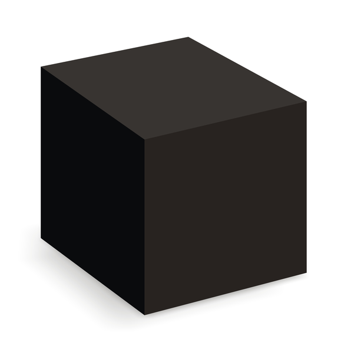
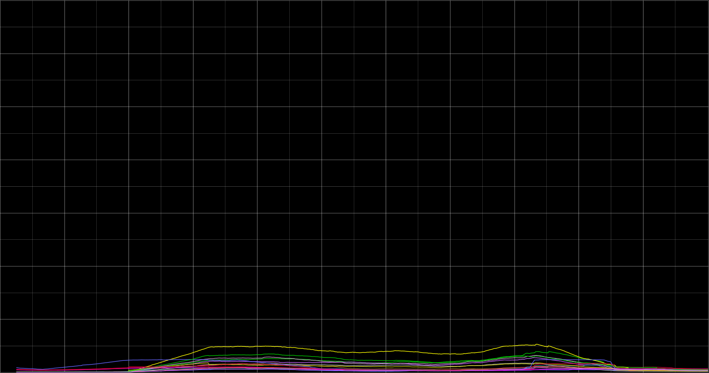

# Metrics - X-ray your app

!SLIDE
# Metrics
## X-Ray your app

!SLIDE
## Morten Siebuhr
[@msiebuhr](https://twitter.com/msiebuhr) / [Github](https://github.com/msiebuhr)

!SLIDE


!NOTES
## A Computer Scientist
University of Copenhagen, Dept. of Computer Science

!SLIDE


!NOTES
Now working - One.com

!SLIDE


!SLIDE
## Questions!

!SLIDE
}}} images/haribos.jpg

!SLIDE
# METRICS?

!SLIDE
## Grab a dictionary

!SLIDE
## №1

Metric: Greek metrikē, from feminine of metrikos in meter, by measure, from
metron measure — more at measure

### Miriam Webster

!SLIDE
## №2

Metric: A standard of measurement

### Miriam Webster

!SLIDE
## №3

No metric exists that can be applied directly to happiness

### Scientific Monthly / Miriam Webster

!SLIDE
#Bullshit!

!SLIDE
## In the beginning

!SLIDE
### Kennedy
## Let´s go to the moon...

!SLIDE
}}} images/Saturn-V-construction.jpg

!SLIDE
}}} images/Saturn-V-transport.jpg

!SLIDE
}}} images/Saturn-V-test.jpg

!SLIDE
}}} images/Saturn-V-pad.jpg

!SLIDE
}}} images/Saturn-V-hold-down.jpg

!NOTES
Holds down 350 metric tonnes at the small pinch-thingie in the top.
http://www.hq.nasa.gov/pao/History/SP-4204/ch13-4.html

!SLIDE
}}} images/Saturn-V-Apollo11-launch.jpg

!SLIDE
## Today

!SLIDE
}}} images/Boeing-787.jpg

!SLIDE
### Boeing 787
## ~ 500 GB / flight

!SLIDE
## Meanwhile in our little world

!SLIDE
# Typically
- Uptime
- Number of served requests
- Apache threads
- CPU load
- ...

!SLIDE
## We already have that
- Munin
- CollectD
- Nagios
- ...

!SLIDE
}}} images/one/relay-cpu-clean.png

!SLIDE
## Stuff slips through the cracks

!SLIDE
## *Your* <br> stuff slips though the cracks

!SLIDE


!SLIDE
## Costs $$$

(Did for us! And still does...)

!SLIDE
## Built on `librrd`
- Complex API
- Can´t combine graphs dynamically

!SLIDE
}}} images/one/old-new_two-axis.png

!SLIDE
#Quick and Dirty

!SLIDE
#`log.info()`
#`printf()`
#+
#`grep`

!SLIDE
## The Good
- Pin-pointing exact problems

!SLIDE
## The Bad
- Inefficient data format
- Difficult to correlate events

!SLIDE
## The Ugly
- Filter important/unimportant
- Difficult to see long-term trends

!SLIDE
Process all webserver logs:

15+ min

!SLIDE
# SLOOOOOOW

!SLIDE
}}} images/one/filesystems+caches-full.png

!SLIDE
## Logging still needed

We have no idea why these filesystems began to act up.

But we *do* know when and where to look in the logs.

!SLIDE
#KISS

!SLIDE
#StatsD
(Originally built by Etsy, inspired by Flickr)

!SLIDE
##Basic idea:

Send UDP with `identifier`, `value` & `type`

Collect & generate regular statistics

Store, Graph and act

!SLIDE
##Basic setup:

Your application + some client

StatsD

Graphite / Hosted / Other

!SLIDE
## Easy metrics

``` js
client = new StatsDClient({server: 'stats.your.tld'})

start_time = Date.now()
client.increment('rpc.connection_opened')
…
client.increment('rpc.response_time', start_time)
```

!SLIDE
## Client in a tweet

``` php
$fp = fsockopen("udp://127.0.0.1",8125);
fwrite($fp,"request.time:1234|ms");
fclose($fp)
```

!SLIDE
## Send over UDP
FAST

Small overhead

Doesn`t add to failure domain

!SLIDE
## StatsD
- Node.js
- No dependencies
- Pluggable backends
- Types: counters/gauges/sets/timings

(~2500 LOC, including test-suite & packaging)

!SLIDE
### Types
## Counters
Gives you absolute reported value + normalized "per second"-numbers

!SLIDE
### Types
## Gauges
Stay the same until you tell it otherwise

!SLIDE
### Types
## Sets
Outputs number of different values seen

!SLIDE
### Types
## Timings
Min/mean/ang/std.dev/max + 90th percentile for all reported values

!SLIDE
### Pluggable backends
amqp
datadog
ganglia
Graphite

librato
OpenTSDB
socket.i0
statsd
zabbix

...

!SLIDE
### Node.js
Don´t worry - clones in pretty much all languages.

!SLIDE
## Ends up in Graphite

!SLIDE


!SLIDE
## Play with it

!SLIDE
## Correlate odd stuff

!SLIDE
### Objective:
## Challenge your assumptions

!SLIDE
## Three things happen

!SLIDE
### № 1
## You will be surprised

!SLIDE
## OMG! WTF?

!SLIDE
We have a hit-rate <50%

!SLIDE
### Assumption:

Varnish outputs more data than it ingests.

!SLIDE
### Data says:

Varnish outputs *less* data than it ingests!

!SLIDE
### №2
## Bug / Configuration error

(Go fix it!)

!SLIDE


!SLIDE
### №3
## Make it a KPI

(Put it on a dashboard, send e-mails, rotating lights, klaxons, &c!)

!SLIDE


!SLIDE


!SLIDE
## Rinse, repeat

!SLIDE
## Do It Yourself

- Write a statsd-client (it´s embarassingly easy!)
- Set up virtual machine / account
- Push data over UDP.
- Verify your assumptions about how your stats should look like

!SLIDE
## Took me a few hours

(Mostly because Graphite is a PITA to set up)

!SLIDE
## Boss day 1:
Don`t waste too much time on it!

!SLIDE
## Boss day 90:
How about 1000x data?

!SLIDE
<!--
## Motivating example
- When stuff goes right
- When stuff goes bad
-->
}}} images/one/time_per_url_endpoint_versus_visitors.png

!SLIDE
## TL;DL
- Distributed printf()´s
- Ultra-simple logging
- Stay on top of things
- Archeology
- Forecasting

!SLIDE
## Questions / Discussion

!SLIDE
## Thanks

### Images
Haribo, NASA, One.com
